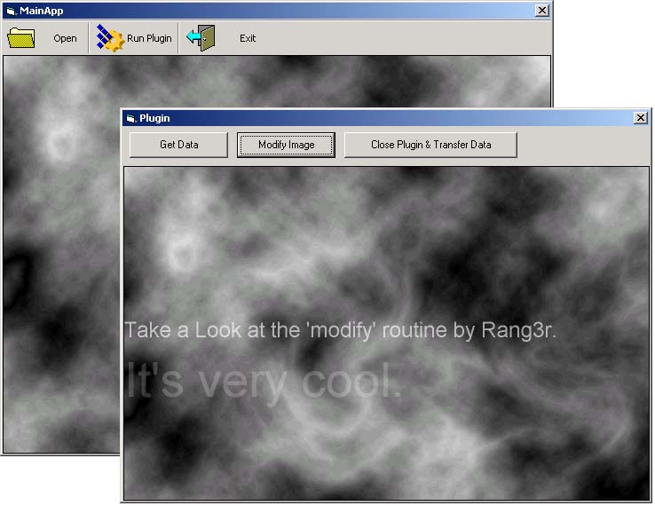



## A true plugin model / Expose your app's objects

### Description

Expose your app's objects / A true plugin model.

This sample will teach you how to expose classes from an ActiveX EXE to other Applications. I felt that a Main App / Plugin relationship (like in Photoshop) will be best suited to showcase this cool solution.

This is how it works:  

When an object gets created based on a class from an ActiveX Exe it gets created

in its own memory area (Multiple objects based on the same class cannot share

their data). In C++ that object registers itself with the ROT (Running Object

Table) so that anybody who needs to, can access that instance of the object.

For instance Excel. When Excel is running you can refer to the running instance

from VBA/VB, and access any data that's present in the spread sheet. However

VB based objects lack that functionality. Activex EXE created in VB will NOT

get registered in the ROT! (That's why you can't use GetObject on VB made ActiveX's

;-) ) 

Anyhow, here is a solution that will register your ActiveX EXE in the ROT,

and you will be able to reference the running instance of your object from any

other application. 

Please use this sample as follows: 

<ol>

<li>Extract Files from Zip (use folder names checked) </li>

<li> run MainApp.EXE (ActiveX EXE) </li>

<li> click on the OPEN icon </li>

<li> load the supplied BMP </li>

<li> wait for a few sec....(sorry the image handling is awfully slow, I didn't

wanted to deal with DIB's for simplicity reasons) </li>

<li> plugin Button should be enabled by now (this calls a ShellExecute and runs

a regular EXE (our plugin) </li>

<li> In the plugin click on GetData (this will transfer the image from the main

app) </li>

<li> click on modify image (thanx Rog3r) </li>

<li> click on Close Plugin & Transfer data (this will transfer the modified

image back to the main app) </li>

<li> Voila </li>

</ol>

The benefits: If you expose your app's objects up front, you can later on create

any plugins/addons you want without modifying the original app. 

This is my first contribution to planet-source-code. Please let me know what

you think (bad/good, anything is welcome) and like always VOTE. 

Thanx  

Raf 

 
### More Info
 

             |
---                |---
**Submitted On**   |2000-10-26 23:52:10
**By**             |[BDCSoftware](https://github.com/Planet-Source-Code/PSCIndex/blob/master/ByAuthor/bdcsoftware.md)
**Level**          |Advanced
**User Rating**    |4.8 (124 globes from 26 users)
**Compatibility**  |VB 6\.0
**Category**       |[OLE/ COM/ DCOM/ Active\-X](https://github.com/Planet-Source-Code/PSCIndex/blob/master/ByCategory/ole-com-dcom-active-x__1-29.md)
**World**          |[Visual Basic](https://github.com/Planet-Source-Code/PSCIndex/blob/master/ByWorld/visual-basic.md)
**Archive File**   |[CODE\_UPLOAD1098410272000\.zip](https://github.com/Planet-Source-Code/bdcsoftware-a-true-plugin-model-expose-your-app-s-objects__1-12319/archive/master.zip)

